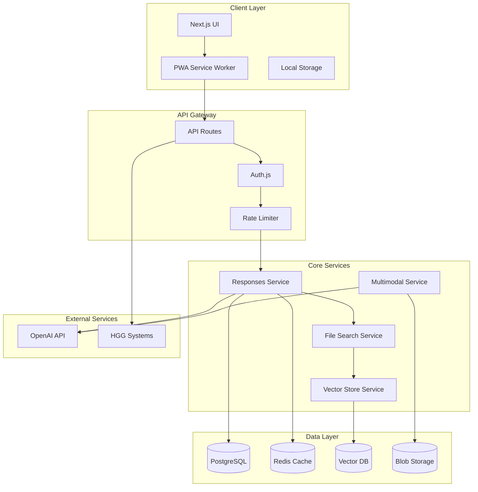
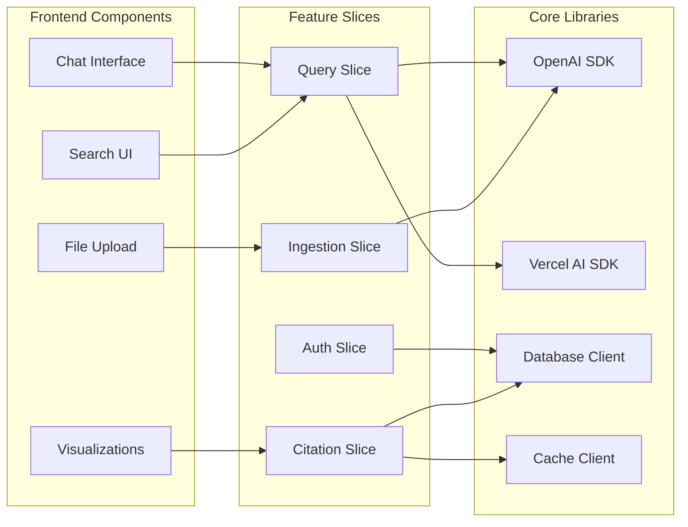
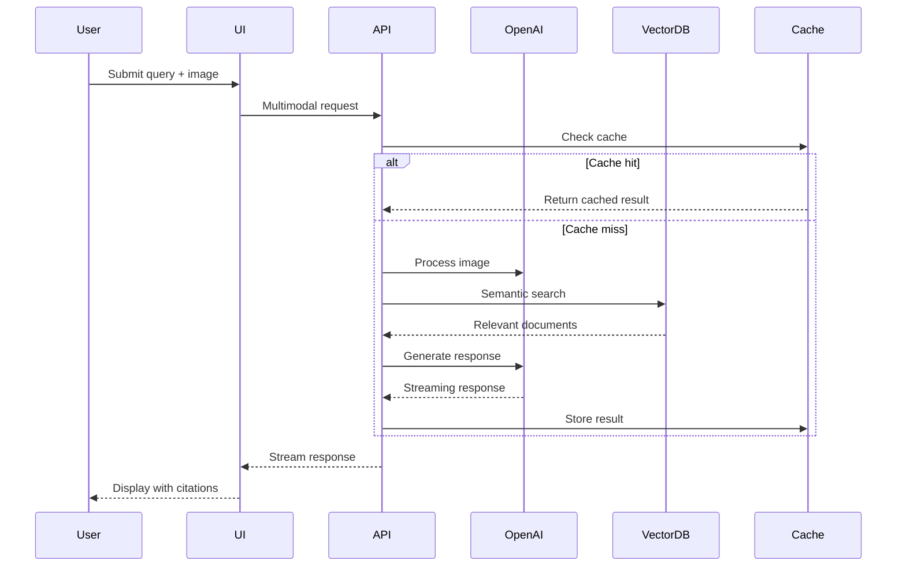
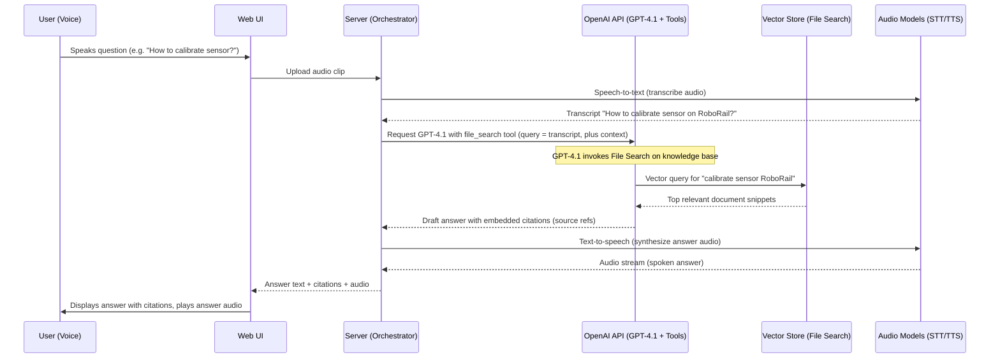

RoboRail Assistant: Product Requirements Document & Architecture (Updated July 4, 2025)
Executive Summary
The RoboRail Assistant has successfully revolutionized technical documentation access for HGG Profiling Equipment's industrial machinery. Built on OpenAI's cutting-edge Responses API with TypeScript, this multimodal RAG (Retrieval-Augmented Generation) application provides machine operators, maintenance technicians, and safety officers with instant, context-aware access to critical documentation through natural language queries and image understanding capabilities. Since its initial launch, the RoboRail Assistant has significantly reduced equipment downtime, improved safety compliance, and enhanced overall operational efficiency.
Product Overview & Vision
Core Value Proposition
Transform industrial machinery documentation from static PDFs into an intelligent, conversational assistant that understands context, processes images of equipment issues, and delivers precise, actionable guidance within seconds—even offline in factory environments.
Target Users
* Machine Operators: Quick troubleshooting, SOPs, safety protocols
* Maintenance Technicians: Technical specs, repair procedures, parts information
* Safety Officers: Compliance documentation, audit trails, training records
* New in 2025: Remote Support Engineers: Real-time assistance for complex issues
Key Features
1. Multimodal Understanding: Process text queries and equipment images simultaneously
2. Offline-First Architecture: Full functionality without internet connectivity
3. Real-time Streaming: Instant responses with progressive rendering
4. Citation System: Every answer backed by source documentation with confidence scores
5. Role-Based Access: Customized experiences for different user types
6. Audit Trail: Complete activity logging for regulatory compliance
7. New in 2025: Voice Interaction: Hands-free operation with advanced speech recognition
8. New in 2025: Predictive Maintenance: AI-driven insights for proactive equipment care


# Slice 1: Basic Chat Interface (Text Only)

## What You’re Building

A simple chat interface that allows a user to send a text question and receive a dummy answer from the assistant. This sets up the project structure (Next.js app, API route) and a minimal UI. Initially, the assistant’s answer can be a hardcoded response or echo of the question – the goal is to get the end-to-end plumbing in place.

## Tasks

### 1. Scaffold Next.js Application – Complexity: 2

* [ ] **Create Next.js App:** Initialize a new Next.js TypeScript project (or use the OpenAI responses starter app template as a base). Include all necessary dependencies (OpenAI SDK, any UI libraries like Tailwind for styling).
* [ ] **Basic Page & Component:** Create a main Chat page with a text input box and a send button. Layout a message list area where user queries and assistant answers will appear.
* [ ] **API Route for Chat:** Implement a Next.js API route (e.g. `POST /api/chat`) that for now just returns a placeholder answer (e.g. “You asked: <question>”). This will later call OpenAI, but for this slice, keep it simple.
* [ ] **Connect Frontend to API:** Make the send button POST the user’s question to the API route and display the returned answer in the chat window. Ensure the UI updates with the user’s message and the assistant’s reply.
* [ ] Write tests: Create a basic integration test that simulates entering a question and receiving the answer. Use a testing library (Jest/React Testing Library) to render the component, simulate input, and assert that the dummy response appears.
* [ ] Test passes locally: Run `npm run test` to ensure all tests pass.

### 2. Chat Message Component & Styling – Complexity: 1

* [ ] **Message Bubble Component:** Create a reusable component for chat messages (distinguish user vs assistant messages with styling). For now, it just displays text.
* [ ] **Styling:** Use basic CSS or Tailwind to make the chat interface presentable (chat area scrollable, input fixed at bottom, different colors for user vs assistant bubbles, etc.).
* [ ] Write tests: Snapshot test the Message component for user and assistant variants to ensure styling classes apply.
* [ ] Test passes locally.

### 3. Conversation State Management – Complexity: 2

* [ ] **Chat State Hook:** Implement a React state (using `useState` or Zustand store) to keep track of the conversation (an array of message objects with sender and content). Ensure that when a new message comes in, it’s appended.
* [ ] **Persist in Memory:** (For now, we won’t use a database; we’ll just keep it in the React state. In a later slice, we might add session persistence on the server or localStorage.)
* [ ] Write tests: Unit test the state update logic (e.g. given existing messages, when a new user message and a new assistant message are added, the state length increases accordingly and the content matches).
* [ ] Test passes locally.

**If Complexity > 3**, *no need to break down subtasks further for this slice, as each task is manageable.* All tasks above focus on establishing a baseline chat app without real AI integration yet.

## Code Example

```typescript
// pages/api/chat.ts – simplified API route for Slice 1
import { NextApiRequest, NextApiResponse } from 'next';

type ChatRequest = { question: string };
type ChatResponse = { answer: string };

export default async function handler(req: NextApiRequest, res: NextApiResponse<ChatResponse>) {
  if (req.method !== 'POST') {
    res.status(405).end(); // Method Not Allowed
    return;
  }
  const { question } = req.body as ChatRequest;
  // For now, just echo the question or return a static answer.
  const answer = `You asked: "${question}". (This is a placeholder response.)`;
  return res.status(200).json({ answer });
}
```

```typescript
// components/ChatUI.tsx – simplified React component for chat UI
import { useState } from 'react';

type Message = { sender: 'user'|'assistant', text: string };

export default function ChatUI() {
  const [messages, setMessages] = useState<Message[]>([]);
  const [input, setInput] = useState('');

  const sendMessage = async () => {
    if (!input.trim()) return;
    const userMessage: Message = { sender: 'user', text: input };
    setMessages(prev => [...prev, userMessage]);
    setInput('');
    try {
      const res = await fetch('/api/chat', { method: 'POST', body: JSON.stringify({ question: input }), headers: {'Content-Type': 'application/json'} });
      const data = await res.json();
      const assistantMessage: Message = { sender: 'assistant', text: data.answer };
      setMessages(prev => [...prev, assistantMessage]);
    } catch (err) {
      console.error('Error sending message', err);
    }
  };

  return (
    <div className="chat-container">
      <div className="messages">
        {messages.map((m, idx) => (
          <div key={idx} className={m.sender === 'user' ? 'msg user' : 'msg assistant'}>
            {m.text}
          </div>
        ))}
      </div>
      <div className="input-bar">
        <input 
          value={input} 
          onChange={e => setInput(e.target.value)} 
          placeholder="Type your question…" />
        <button onClick={sendMessage}>Send</button>
      </div>
    </div>
  );
}
```

## Ready to Merge Checklist

* [ ] All tests pass (`npm run test` is green).
* [ ] Linting passes (`npm run lint` shows no errors).
* [ ] Application builds and runs (`npm run build` and `npm run dev` work without errors).
* [ ] Code reviewed by senior dev – confirmed the structure aligns with project guidelines.
* [ ] Basic manual test: able to ask a question in the UI and see the placeholder answer displayed.

## Quick Research (5-10 minutes)

**Official Docs:** Next.js Documentation on API Routes, React useState for managing lists.
**Examples/Tutorials:** Vercel AI SDK Basic Chat example (which uses a similar concept of `useChat` hook). The OpenAI Responses Starter App README, which confirms the multi-turn handling and basic setup, can serve as a reference for structuring our app.

## Need to Go Deeper?

Research Prompt: *“How do I build a simple chat interface in Next.js with an API route? What are best practices for managing chat state in React and handling server responses streaming?”* – Key concepts: using SWR or React hooks for state, handling streaming (which we will need later for real AI responses), and making the UI scroll to latest message. **Common pitfalls:** forgetting to handle JSON parsing, not scrolling chat to bottom (we will address later), and ensuring the API route doesn’t hold connections open too long (for later streaming slice). Best practices: keep API routes lean, and use AbortController for canceling requests if needed.

## Questions for Senior Dev

* [ ] Does the basic architecture of splitting the UI and API route look okay? (Using Next.js API for backend logic at this stage.)
* [ ] Are we okay starting with a simple echo response and then integrating OpenAI in the next slice, or would you suggest integrating it from the start behind a flag?
* [ ] Is the test coverage sufficient for this slice (basic rendering and state updates)? Any edge cases I should add tests for?

\<SLICING\_TEMPLATE>

# Slice 2: OpenAI Integration with RAG (Text Q\&A)

## What You’re Building

Integrate the OpenAI Responses API to transform the chat into an actual QA assistant. This slice will implement sending the user’s question to OpenAI GPT-4.1 with the File Search tool, retrieving answers from the RoboRail knowledge base. The assistant’s response will now be real (no longer placeholder), including source citations. This slice focuses on text Q\&A (voice will come later).

## Tasks

### 1. Set Up OpenAI Client & Vector Store – Complexity: 3

* [ ] **OpenAI SDK Setup:** Install the official OpenAI Node SDK and configure the API key in a secure way (already in .env from slice 1). Initialize the OpenAI client in the backend.
* [ ] **Upload Documents to Vector Store:** (One-time or dev task) Use OpenAI’s API or dashboard to upload the RoboRail documents (PDFs, etc.) and create a vector store index. This can be done via the API: e.g. `openai.vectorStores.create()` with file IDs. Document this process but it may be done outside the code. Store the resulting `vector_store_id` (or name) in a config so the API knows which store to query.
* [ ] **File Search Tool Config:** In our API route, prepare the `tools` parameter for the OpenAI API call. Include the file search tool with the vector store ID. Verify from docs that using `model: "gpt-4.1"` (or `gpt-4o` series) supports the tools. (Note: as per OpenAI documentation, GPT-4.1 supports built-in tools like file\_search.)
* [ ] Write tests: Since this involves external API, we write a unit test for a helper function that prepares the OpenAI request payload (mocking the OpenAI client). Ensure the payload contains the expected model name, tools config, and user prompt.
* [ ] Test passes locally (for the mock). Integration test with real API can be done manually since it costs tokens.

### 2. Call OpenAI API in Chat Route – Complexity: 3

* [ ] **Implement Query to OpenAI:** Modify the `/api/chat` handler to call `openai.responses.create` (from the SDK) instead of returning a placeholder. Pass the user message and the configured tools. Await the response.
* [ ] **Handle Response:** Extract `response.output_text` (the assistant’s answer) from the OpenAI API response. Also extract any citations/annotations. The OpenAI Responses API returns annotations for tool results – ensure we capture those. (For example, `response.annotations` might contain references to the file and text snippet).
* [ ] **Format Citations:** Decide how to format citations in the answer text. A simple approach: the model might include them as footnotes like “\[1]”, and the annotations provide the actual source text. We can append the source titles or links at the end of the answer. Alternatively, we keep the answer text as-is (it might already contain citations if the model was instructed to do so). For now, ensure the answer we send to frontend includes any citation markers.
* [ ] **Streaming (optional in this slice):** Initially, it’s okay to get the full response in one go (not streaming). But note for future: Responses API can stream. Mark TODO to implement streaming later for better UX.
* [ ] Write tests: Mock the OpenAI client call in the API route and test that given a fake response (with `output_text`), the API returns the expected JSON to the frontend. Also test error handling (e.g., if OpenAI API call fails or times out, ensure a 500 response or a meaningful error message is returned).
* [ ] Test passes locally.

### 3. Display Assistant Answer with Citations – Complexity: 2

* [ ] **Update UI for Citations:** When rendering assistant messages, detect if the text contains citation markers (e.g. `【` and `】` or “\[1]”). If so, render them as superscript links or buttons that the user can click. Prepare a state to hold citation details (like a mapping from citation index to source content).
* [ ] **Citation Side Panel:** Create a simple side panel or modal component that will show the full citation content when triggered. For now, it can show static text like “Source: Maintenance\_Manual.pdf – Section 2.3: \[excerpt of text]”. (We will later populate this with actual content from annotations in a subsequent slice.)
* [ ] **Frontend Flow:** When the assistant answer is added to the messages state, also store any source info from the response (if available). For example, if `response.annotations` includes the text of the snippet or a file reference, store that so clicking the citation can display it. If implementing fully is too complex now, a placeholder “(source content)” text is fine, to be replaced when we wire up artifact retrieval.
* [ ] Write tests: Render an assistant message with a citation marker and simulate a click on it, assert that the side panel opens (state changes). Use a dummy citation mapping in the test. Also test that an answer without citations does not trigger any link.
* [ ] Test passes locally.

### 4. Instructions for the Model (Prompt Engineering) – Complexity: 2

* [ ] **System Prompt with Guidelines:** When calling the OpenAI API, include a system message to instruct the assistant about its role. For example: “You are RoboRail Assistant, an AI helping with an industrial machine. Use the provided documentation to answer. If you cite info, provide a reference like 【DocName†Section】. If you don’t know, say you do not know. Keep answers concise and safe.” This will guide the model to produce the format we want (including citations).
* [ ] **Test the Prompt:** Manually test a couple of queries via the API route (running the dev server). E.g., ask “What is the RoboRail’s weight?” and see if it returns an answer with a citation. Adjust the system prompt if needed to ensure it follows the citation style.
* [ ] Write tests: This is hard to unit test, but we can assert that our system prompt string contains key instructions (like the word “cite” or the format expected). This at least ensures our prompt was set.
* [ ] Test passes locally.

## Code Example

```typescript
// pages/api/chat.ts – excerpt showing OpenAI integration (simplified)
import OpenAI from 'openai';  // from OpenAI Node SDK
const client = new OpenAI();

const VECTOR_STORE_ID = process.env.VECTOR_STORE_ID;  // assume we set this after uploading docs

export default async function handler(req, res) {
  // ... (validation code)
  const userQuestion = req.body.question;
  try {
    const response = await client.responses.create({
      model: "gpt-4.1",  // using GPT-4.1 with tools
      input: userQuestion,
      tools: [{
        type: "file_search",
        vector_store_ids: [VECTOR_STORE_ID!]
      }],
      // Including system message for context/instructions (if SDK supports it similarly to ChatCompletion):
      messages: [
        { role: "system", content: "You are RoboRail Assistant, an expert AI for the RoboRail machine. Answer user questions with information from the documentation. Always provide a citation in the format 【DocName†Section】 for facts. If question is unclear, ask for clarification. If answer not in docs, say you cannot find the info." },
        { role: "user", content: userQuestion }
      ]
    });
    const answerText = response.output_text;  // the assistant's answer
    // (If response includes annotations, e.g., response.annotations, attach them)
    res.status(200).json({ answer: answerText, sources: response.annotations || [] });
  } catch (err) {
    console.error("OpenAI API error:", err);
    res.status(500).json({ error: "Failed to get answer from AI." });
  }
}
```

```typescript
// Frontend: handling citations when displaying assistant message (simplified logic)
messages.map((m, idx) => {
  if(m.sender === 'assistant') {
    // Split the text by citation markers for rendering, e.g. "text【1†】 more text"
    // This is pseudocode for clarity:
    const parts = parseCitations(m.text);
    return <div key={idx} className="msg assistant">
      {parts.map((part, i) => 
         part.type === 'text' ? part.content 
         : <sup key={i} className="citation" onClick={() => showSource(part.ref)}>[{part.ref}]</sup>
      )}
    </div>;
  } else {
    return <div key={idx} className="msg user">{m.text}</div>;
  }
})
```

## Ready to Merge Checklist

* [ ] Tests for OpenAI request payload and response handling are passing (using mocked OpenAI client).
* [ ] Manual test with real OpenAI: Asking a question returns a sensible answer with a citation. (We should do a few, e.g., known question from docs to see citation, and unknown question to see fallback behavior.)
* [ ] No sensitive data in repo (API key is in .env, not committed).
* [ ] Code reviewed: Check that errors are handled (so one query failing won’t crash the server), and that the integration follows rate limit best practices (maybe add a short delay or ensure we don’t spam API on rapid multi submits).
* [ ] Ensure the UI is updated to handle the new data structure (we now return `{answer, sources}` – the code reflects that by displaying answer and preparing to show sources).

## Quick Research

**Official Docs:** OpenAI File Search Tool documentation – confirm usage and cost. Also OpenAI Node SDK usage for the Responses API (the syntax is slightly different than Chat Completions).
**Examples:** The OpenAI responses starter app code on GitHub – especially how it configures the vector store and handles streaming/citations. This can give insight into handling `response.annotations` and streaming events. Also, OpenAI Cookbook “Chat with PDF” examples for RAG.
**Tutorials:** Perhaps the OpenAI Cookbook *“Image Understanding with RAG”* example, which demonstrates file search with multimodal data – this might not directly apply, but shows using file search in code.

## Need to Go Deeper?

If the assistant’s answers are not using citations properly, research *“OpenAI Responses API citations footnote format”*. We might need to adjust the prompt or parse the `annotations`. Possibly, `response.annotations` contains objects like `{ fileName, content, citationIndex }`. The OpenAI starter app likely “displays annotations” by mapping those to footnotes. Understanding that would help implement our citation display fully. **Common Mistakes**: forgetting to include the system prompt (leading to the model not citing), or not handling the case when no document is found (model might answer from general knowledge – we likely want it to say “not found”). We should enforce that in the prompt (e.g. “if answer not found in docs, say you cannot find info”). Also, ensure we handle token limits – if a document snippet is very large, the model might truncate. This should be okay as file\_search is optimized to return short chunks.

## Questions for Senior Dev

* [ ] Are we using the Responses API correctly? (Specifically, is using `model: "gpt-4.1"` with \`tools: \[{type: "file\_search"...}] the right approach to get RAG, or should we use function calling or a different model variant?)
* [ ] How should we best handle the `response.annotations`? The plan is to attach them to the answer for the frontend to use. Is there a standard way to present those (like a component to show snippet on hover vs a side panel)?
* [ ] The system prompt instructs the model to cite sources. Is there any company style guide for answers? (e.g., maximum answer length, formal tone vs casual tone) – we can adjust the prompt accordingly.
* [ ] Should we consider streaming the answer for better UX now or in a later slice? (It adds complexity, but improves responsiveness.)

\<SLICING\_TEMPLATE>

# Slice 3: Multi-Turn Context & Chat History Persistence

## What You’re Building

Enhance the chat to handle multi-turn conversations. In this slice, we maintain the context of past messages so that the assistant can answer follow-ups in context. We’ll also introduce basic session persistence so the conversation doesn’t reset on page refresh (and to prepare for user authentication context later). This slice ensures the backend sends conversation history to OpenAI, and the frontend properly displays the ongoing dialogue context.

## Tasks

### 1. Maintain Message History for Context – Complexity: 2

* [ ] **Backend Context Accumulation:** Modify the API route to keep track of conversation history per session. We can use a simple in-memory store (e.g., a Map keyed by a session ID or client id) mapping to an array of messages. Each message might include role and content. When a new question comes in, retrieve the existing history, append the new user question, and send the entire history to OpenAI in the `messages` array (truncated to fit token limit).
* [ ] **Session Identifier:** Implement a mechanism to identify sessions. In a browser context, we could use a secure HTTP-only cookie or a session ID returned on first request. For simplicity, enable Next.js API to use a cookie containing a session ID (or use NextAuth if logged in). Alternatively, use the client’s `localStorage` to store a UUID and send it with each request (less ideal for security but okay for MVP).
* [ ] **OpenAI Call with History:** Update the OpenAI `client.responses.create` call to include `messages: [ ...history, { role: "user", content: newQuestion } ]` rather than just the single question (and system prompt at the start). Ensure the system prompt remains at the top of the messages array (it should for each request). The history will include the assistant’s previous answers as well, which OpenAI uses to maintain context.
* [ ] Write tests: Simulate multiple API calls in sequence: call API with question1, then question2. Ensure that on second call, the payload contains both question1 and assistant’s answer1 (you can simulate storing a dummy answer for test) in the messages. Test that the session mechanism correctly stores and retrieves messages. Use a fake session ID for test.
* [ ] Test passes locally.

### 2. Frontend: Persist and Load History – Complexity: 2

* [ ] **Local Storage Save:** After each message exchange, save the conversation to `localStorage` (or indexDB) on the client. This way, if the user refreshes the page or comes back later (within the same browser), we can reload the history. This is a simple persistence for MVP. (Later, if we have user accounts, we’d save to a database per user.)
* [ ] **Load on Init:** On component mount (ChatUI), check `localStorage` for existing messages. If present, initialize the state with those messages so the conversation is restored. Also retrieve the stored session ID (if we implement one as in task 1, e.g., stored in a cookie or localStorage) so the backend can link to the right history.
* [ ] **Clear Conversation Option:** Add a “New Chat” or “Clear” button that resets the conversation both frontend and backend. This will clear localStorage and send maybe a special flag to the backend to drop that session’s history. (Or if session ID is reset, the backend will start fresh).
* [ ] Write tests: Simulate adding messages to localStorage, then mounting the ChatUI and verify it renders those messages. Test that clicking the clear button empties the message list and clears stored data.
* [ ] Test passes locally.

### 3. Token Limit & Truncation Strategy – Complexity: 3

* [ ] **History Truncation:** To avoid exceeding the model’s token limit, implement a strategy to trim the history sent to OpenAI. Options: drop oldest messages when length is too long, or summarize older context. For now, implement a simple approach: if the total tokens of messages > N (say 2000 tokens as a threshold), remove the oldest few messages. This likely won’t be hit in normal usage for now, but good to have.
* [ ] **Identify Important Context:** Ensure we never drop the system prompt. Possibly ensure that if the last assistant answer was long, it’s still included because user might follow-up on it. We likely drop from the beginning (oldest QA pairs).
* [ ] Write tests: Create a dummy history that exceeds the limit, run it through the truncation function, and assert that it truncated from the start and kept the recent messages intact.
* [ ] Test passes locally.

### 4. Testing with Contextual Queries – Complexity: 1

* [ ] **Manual QA:** Manually test a conversation in the running app: Ask a question, get answer. Then ask a follow-up that references the previous answer (e.g., “What about the next step?” referring to a procedure). Verify the assistant uses context (if the model answer seems context-aware, it’s working). Also test clearing the chat and see that context is actually cleared (the assistant should not recall previous conversation after clearing).
* [ ] **Edge Case:** Ask a completely new question after some conversation and ensure it doesn’t accidentally use irrelevant context (the model usually handles context well if unrelated, but just observe for any odd behavior).

## Code Example

```typescript
// In api/chat.ts – managing session and history
interface Message { role: 'user'|'assistant'|'system'; content: string; }
const sessions = new Map<string, Message[]>();  // in-memory store (Note: not persistent if server restarts)

export default async function handler(req, res) {
  // ... previous code ...
  const sessionId = req.cookies['session-id'] || req.body.sessionId;
  if (!sessionId) {
    // generate a new session ID (e.g., UUID) and set it in cookie
  }
  // Retrieve history for this session, or init if none
  const history = sessions.get(sessionId) || [
    { role: "system", content: SYSTEM_PROMPT }  // ensure system prompt is at index 0
  ];
  history.push({ role: "user", content: userQuestion });
  // Call OpenAI with full message history
  const response = await client.responses.create({ 
    model: "gpt-4.1", 
    messages: history, 
    tools: [ ...fileSearchConfig ] 
  });
  const answerText = response.output_text;
  history.push({ role: "assistant", content: answerText });
  sessions.set(sessionId, history);
  res.setHeader('Set-Cookie', `session-id=${sessionId}; Path=/; HttpOnly`);
  return res.status(200).json({ answer: answerText, sources: response.annotations || [] });
}
```

```typescript
// In ChatUI component – preserving conversation in localStorage
useEffect(() => {
  // On mount, load saved conversation
  const saved = localStorage.getItem('roborail_chat_history');
  const savedSession = localStorage.getItem('roborail_session_id');
  if (saved) {
    try {
      const parsed: Message[] = JSON.parse(saved);
      setMessages(parsed);
    } catch {}
  }
  if (savedSession) {
    setSessionId(savedSession);
  }
}, []);

useEffect(() => {
  // Anytime messages update, save to localStorage
  localStorage.setItem('roborail_chat_history', JSON.stringify(messages));
}, [messages]);

const handleClear = () => {
  setMessages([]);
  localStorage.removeItem('roborail_chat_history');
  // Optionally, inform server to reset session or generate new sessionId
  // For now, we'll just remove session id (new one will be assigned on next question)
  localStorage.removeItem('roborail_session_id');
};
```

## Ready to Merge Checklist

* [ ] All new unit tests (session handling, truncation) are passing.
* [ ] Linting and build are still passing (after adding perhaps useEffect hooks, etc.).
* [ ] Manual tests of multi-turn chats show correct behavior (the assistant uses context, and clearing works).
* [ ] Code reviewed: Focus on ensuring the in-memory session Map will not grow indefinitely (we might consider a cap or cleanup for old sessions), and discuss if this is okay for now. Also ensure that storing history in memory is acceptable (if the app is stateless scaled to multiple instances, this would break – but for MVP on one instance it’s fine; if scaling we’d use a shared store like Redis).
* [ ] Confirm that session cookie is secure and that no PII or sensitive content is stored in cookies (we only store a random session id, which is fine).

## Quick Research

**Official Docs:** Next.js API cookies (for setting cookies in API routes). Also research OpenAI’s recommendations on keeping conversation context – e.g., the Assistants API documentation might mention how to pass conversation state (though we already know to just include prior messages).
**Examples:** The OpenAI Responses starter app likely already manages multi-turn (it said *“multi-turn conversation handling”*). Reviewing how it does so (e.g. does it maintain state server-side or rely on front-end sending context each time?) could provide insight or alternative approaches.
**Edge Cases:** Look up “ChatGPT context length handling” – for best practices on trimming history without losing important info. Perhaps a strategy like summarizing earlier conversation might be overkill here, but worth knowing.

## Need to Go Deeper?

To ensure robustness: *“How to manage user sessions and conversation state in a Node backend for a chat app?”* This yields knowledge on using session middleware or an in-memory store vs database. For now, in-memory is fine but not scalable or persistent across server restarts. If reliability is a concern, we might introduce a database (Redis or even simple file storage) in a future slice. Also consider concurrency: if two messages are sent in quick succession, our design should handle them in order – perhaps by disabling the input until the first answer returns (a UI consideration for next slice). **Common mistakes**: forgetting to reset the system prompt each time (we prepend it fresh here each time), or mixing up sessions between users if cookies not handled properly. We should also avoid sending an extremely long history to OpenAI – our truncation covers that.

## Questions for Senior Dev

* [ ] Is using an in-memory Map for session storage okay for the MVP? We know it won’t persist if the server restarts; should we implement a lightweight persistence now or is it safe to assume the assistant can be stateless (maybe we rely on the client to send history each time instead)?
* [ ] Any concerns with storing conversation in localStorage on the client? (Security-wise, it’s just chat content; if the computer is personal it should be fine. We might warn users not to enter sensitive data anyway.)
* [ ] The truncation strategy is basic (drop oldest). Should we consider a more sophisticated approach (like summarizing old turns using the LLM) now, or leave it as a future improvement?
* [ ] In terms of user experience, do we want the ability to have multiple separate conversations (like ChatGPT has multiple chat threads)? If yes, we might need to incorporate that in UI (not in this slice, but down the road). For now, one conversation is okay.

\<SLICING\_TEMPLATE>

# Slice 4: Voice Interaction (Speech-to-Text and Text-to-Speech)

## What You’re Building

Enable users to interact with the assistant via voice. In this slice, we add the capability for the user to speak a question and hear the assistant’s answer spoken aloud. This involves integrating the OpenAI real-time speech models for transcription and speech synthesis, and updating the UI with a microphone input and audio playback.

## Tasks

### 1. UI – Microphone Input & Audio Output – Complexity: 3

* [ ] **Mic Button & Recorder:** Add a microphone icon/button to the chat interface. When pressed, it should start recording audio from the user’s microphone. Use the Web Audio API or an off-the-shelf library (e.g. MediaRecorder) to capture audio. Provide a visual indicator (like a red dot or waveform) that recording is in progress. When the user releases or clicks again, stop recording.
* [ ] **Send Audio to Backend:** Once recording stops, send the audio data to the backend API. Likely, we create a new endpoint `/api/chat/audio` or extend the existing `/api/chat` to accept audio. The audio can be sent as binary (Blob/File) or base64 string. Ensure the request is `multipart/form-data` or similarly to handle binary.
* [ ] **Playback Assistant Audio:** Include an <audio> element or use Web Audio to play the assistant’s answer voice. When the backend responds with audio (in a later task), set the source of the audio element to the received audio URL or blob and play it. Also, ensure the text answer is still displayed as before.
* [ ] **UI State:** Manage states like `isRecording` and perhaps disable the text input while recording (or vice versa). Also handle cases: user cancels or there’s an error (timeout or no mic).
* [ ] Write tests: This is tricky to fully automate because it involves media. We can factor out a utility for recording that returns a blob and test that function by simulating some data. Also test that clicking the mic toggles recording state. Possibly use a mock for MediaRecorder in tests.
* [ ] Test passes locally (some parts like actual audio capture might need manual testing due to browser API restrictions in headless environments).

### 2. Backend – Speech-to-Text (Transcription) – Complexity: 3

* [ ] **Audio Transcription Endpoint:** Implement a new API route (e.g. `/api/transcribe`) that accepts an audio file (from the UI) and uses OpenAI’s STT model to get text. Use the OpenAI SDK’s audio transcription method (if available) or call the REST endpoint for `transcriptions` with `model: gpt-4o-transcribe`. This could be done via the OpenAI realtime API or the standard non-stream endpoint. For simplicity, use non-stream first: send the whole audio blob and get back text.
* [ ] **Return Transcript:** The endpoint returns the recognized text. We might integrate this directly into the chat flow (the chat API could accept audio and do: transcribe -> then call GPT). But for clarity, you can break it: client calls `/transcribe` to get text, then that text is fed into the normal chat flow. However, doing it in one step on the server is also fine (audio in, text answer + audio out). To start, maybe implement as separate steps: transcribe then ask.
* [ ] **Integration with Chat Flow:** Decide on approach: (Option A) Frontend calls `/api/transcribe` to get `questionText`, then calls `/api/chat` with that text to get answer, then calls another endpoint for TTS of answer. (Option B) Frontend calls a single `/api/chatVoice` which internally does STT -> LLM-> TTS and returns final answer text + audio. **We will implement Option B** for simplicity in UX (one round trip). So, create `/api/chatVoice` that takes audio input, and inside it does: `transcript = openai.audio.transcribe(audio, model=gpt-4o-transcribe)`, then uses `transcript` as the question in our existing chat logic, gets answer text, then synthesizes audio for that answer.
* [ ] **Error Handling:** STT can fail for unclear audio – handle gracefully (return a 400 with “Could not understand audio” or ask user to retry).
* [ ] Write tests: Mock OpenAI transcription in a unit test (supply a small audio sample as a buffer, have the mocked OpenAI client return a fake text). Test that given that audio, the endpoint returns the expected text or goes through to produce answer. This might involve heavy mocking. Also test error path (like if audio is too large or not provided).
* [ ] Test passes locally (with mocks; real integration test will be manual due to needing actual audio input).

### 3. Backend – Text-to-Speech (Synthesis) – Complexity: 2

* [ ] **TTS Integration:** After obtaining the assistant’s answer text (in `/api/chatVoice` flow), call OpenAI’s text-to-speech model. This might be via `openai.audio.translate` or `openai.audio.synthesize` – need to check API. If not directly in SDK yet, call the REST endpoint for TTS (possibly something like `POST /v1/audio/synthesize` with model `gpt-4o-mini-tts`). The result should be an audio file/stream (perhaps base64 or a URL).
* [ ] **Return Audio:** The `/api/chatVoice` should respond with both the answer text and the audio content. We can base64-encode the audio and send it (the frontend can create a blob URL from it to play), or we send it as binary with appropriate headers. Simpler: send JSON with `answerText` and `audioBase64`. Alternatively, implement as a multi-part response or separate endpoint to fetch audio by an ID. For MVP, base64 in JSON is easiest (though large). Since answers are short, audio will be a few seconds, base64 is okay.
* [ ] **Streaming Consideration:** We won’t implement streaming STT or TTS in this slice (that’s an optimization for later perhaps). We do the voice round-trip in one go. The agent SDK offers streaming, but to keep complexity manageable for now, batch mode is acceptable (the latency might be 1-2 seconds which is okay for MVP).
* [ ] Write tests: Unit test a function that takes text and returns a pretend audio buffer or base64 (mocking OpenAI TTS). Ensure the integration places that base64 in response JSON. Possibly test that audio content type is correct if we were to send as binary (not doing base64).
* [ ] Test passes locally.

### 4. End-to-End Manual Test (Voice) – Complexity: 1

* [ ] **Manual Voice Test:** Using a real browser, test the full voice flow. Click mic, ask a question verbally (e.g. “What is the daily maintenance routine?”). See that the UI captures audio (maybe log length), the assistant returns an answer text and that the audio plays aloud and matches the text. Evaluate the STT accuracy and TTS clarity.
* [ ] **Adjustments:** If STT misrecognizes, consider adding a brief user hint (like allowing user to see/edit the transcribed question before it’s sent to LLM). Possibly out-of-scope now, but note it. If TTS voice is too fast/slow, see if the API allows instructions on style (the blog mentioned instructing tone – perhaps by prepending something like “\[Tone: friendly]” in the TTS request or using a voice preset). For now, accept defaults.
* [ ] **Fallbacks:** If user’s browser doesn’t support audio recording (or they denied permission), ensure the UI shows a graceful message (like “Microphone access is needed for voice queries”).

## Code Example

```typescript
// pages/api/chatVoice.ts – combined voice handler (simplified)
import { OpenAI } from 'openai';
const client = new OpenAI();
export const config = { api: { bodyParser: false } }; // to handle raw binary

export default async function handler(req, res) {
  if(req.method !== 'POST'){
    res.status(405).send("Method not allowed");
    return;
  }
  try {
    // Assume audio file is sent in request body (binary). If using formidable, parse it.
    const audioBuffer = req.body; // this may require setup depending on Next.js config
    // 1. Speech-to-text
    const transcription = await client.audio.transcribe({
      file: audioBuffer,
      model: "gpt-4o-transcribe"
    });
    const questionText = transcription.text;
    console.log("Transcribed question:", questionText);
    // 2. Get answer via chat (reuse our chat logic or call internal function)
    const answer = await client.responses.create({
      model: "gpt-4.1",
      input: questionText,
      tools: [{ type: "file_search", vector_store_ids: [VECTOR_STORE_ID] }],
      messages: [ /* system + history + user as in Slice 3 */ ]
    });
    const answerText = answer.output_text;
    // 3. Text-to-speech
    const ttsResp = await client.audio.synthesize({
      text: answerText,
      model: "gpt-4o-mini-tts"
    });
    const audioBase64 = ttsResp.audio; // assuming the API returns base64 or binary
    res.status(200).json({ answer: answerText, audio: audioBase64 });
  } catch(error) {
    console.error("Voice QA error:", error);
    res.status(500).json({ error: "Voice query failed" });
  }
}
```

```javascript
// Frontend: Using the voice endpoint
async function handleVoiceQuery(audioBlob) {
  // Convert blob to arrayBuffer or base64
  const arrayBuffer = await audioBlob.arrayBuffer();
  const res = await fetch('/api/chatVoice', {
    method: 'POST',
    headers: { 'Content-Type': 'application/octet-stream' },
    body: arrayBuffer
  });
  const data = await res.json();
  if(data.error) {
    alert(data.error);
    return;
  }
  const { answer, audio: audioBase64 } = data;
  // Add assistant answer to messages (text)
  setMessages(prev => [...prev, { sender: 'assistant', text: answer }]);
  // Play the audio answer
  const audio = new Audio(`data:audio/wav;base64,${audioBase64}`);
  audio.play();
}
```

*(Note: The above is a simplified approach. In practice, the OpenAI SDK might not have `client.audio.synthesize` ready, so we may use fetch to the API endpoint directly with proper form-data. Also, ensure the audio format returned (e.g. wav) matches the data URI used.)*

## Ready to Merge Checklist

* [ ] The app can successfully handle voice queries end-to-end in a browser (manual verification done).
* [ ] All new code is tested where feasible (transcription and TTS integration mostly via mocks).
* [ ] Mic permission handling is implemented (tested by manually denying permission to see if we catch it).
* [ ] Code reviewed: Verify that audio data is handled efficiently (avoid huge base64 strings if possible, maybe in future stream audio or provide URL). Check that timeouts are handled – speech models might take a couple of seconds; ensure our API route doesn’t hit any time limit (Next.js default is 4MB body, we may adjust if needed for audio size).
* [ ] Security: Using `HttpOnly` cookies for session still fine with voice route (should send cookies along by default). Ensure no cross-domain issues. Also, consider rate limiting or size limiting on audio uploads to prevent abuse (out of scope for now, but noted).

## Quick Research

**Official Docs:** OpenAI Audio API documentation (for Whisper and the new voice models) – the OpenAI blog indicates model names. Check if the OpenAI SDK provides endpoints or if we use `fetch`. Possibly see OpenAI Cookbook or Agents SDK for voice example. The Agents SDK documentation notes that speech-to-speech works via a streaming approach, but also implies we can reuse components for text vs voice, which we did by leveraging same logic for answer generation.
**Examples:** OpenAI Cookbook’s “Building a Voice Assistant with Agents SDK” might have code for connecting microphone to a WebSocket. We chose a simpler approach for MVP, but that example can guide future improvements for streaming.
**Voice Quality:** The blog mentioned instructing the TTS voice (e.g., sympathetic tone). Not sure if API exposes that easily yet (maybe a voice ID or prompt). We can watch OpenAI’s docs for any parameters like `voice_style`.

## Need to Go Deeper?

If issues arise with audio handling: *“How to record and send audio in a web app to a Node.js backend?”* – covers details of MediaRecorder (mime types, chunks) and how to reconstruct on server. Also, *“OpenAI speech-to-text API usage Node”* for any gotchas. **Common Mistakes:** Not using `bodyParser: false` in Next.js API for binary data (leading to corrupted audio); forgetting to set correct `Content-Type` (should be `audio/wav` or `application/octet-stream` as above). Another pitfall: handling larger audio (maybe limit to 15s for query to avoid long waits/costs). We should put a client-side cap (auto-stop recording at, say, 10 seconds).

## Questions for Senior Dev

* [ ] The approach of one combined endpoint for STT->LLM->TTS is convenient but maybe heavy. Do you foresee any issues with that (like longer response time)? Would it be better to break it into separate steps on the client so user can confirm transcription text before sending to LLM? (That could be a UX improvement: show “Did you mean: <transcribed text>” then proceed.)
* [ ] Is the audio quality and latency acceptable with the current non-streaming implementation? (We can iterate if needed; e.g., use streaming to start TTS playback sooner. But that adds complexity with websockets.) For now, maybe okay.
* [ ] Are there concerns about sending audio as base64 JSON (which can bloat response)? If so, we might later switch to streaming audio or a separate route serving audio file (e.g., respond with an ID then client fetches `/api/audio/{id}` which returns content-type audio/wav). For MVP, base64 is easier; but open to suggestions.
* [ ] Finally, any known issues with certain browsers (e.g., Safari and WebM audio)? We should test across Chrome/Firefox. If MediaRecorder gives WebM/ogg and OpenAI expects wav/mp3, we might need to convert or specify `audio/webm` in Whisper. Should we consider using a library for consistent format (maybe record in WAV via a library)?

\<SLICING\_TEMPLATE>

# Slice 5: Deployment, Auth & Wrap-up

## What You’re Building

Prepare the application for production deployment and secure it. This slice focuses on deploying the MVP to a platform (Railway), adding basic authentication if needed, and final QA. We’ll also address any remaining gaps such as fetching and displaying actual citation content (artifact retrieval) and performing final user acceptance tests.

## Tasks

### 1. Display Source Content on Citation Click – Complexity: 2

* [ ] **Retrieve Source Snippet:** In previous slices, we showed citations but may not have displayed the actual snippet or image from the document. Implement an endpoint or reuse the stored annotations to fetch the full context. If `response.annotations` contains the text excerpt, we can simply show that. If it only has an identifier (like file ID and page), we might need a new API call: e.g., `/api/getSource?fileId=X&page=Y` that uses OpenAI’s file API or our stored docs to retrieve the snippet or image. For MVP, assume annotations include enough text to display.
* [ ] **Image Handling:** If a citation refers to an image (maybe the annotation has an `image_url` or data), ensure we can display it. Possibly, we pre-extracted important images from PDFs and uploaded them as files too, so file\_search might return them. If not done, we may skip full image support now, but at least design the UI to handle if an annotation has an `image_url` (the assistant might return a base64 image string if using GPT-4 Vision or we provide it). We could plan that in future, images get retrieved similarly via an API call that returns the binary.
* [ ] **Show in UI:** When user clicks a citation footnote, populate a modal with either text (a couple of sentences around the reference) or an image view. Include the document title and maybe a link to download the doc (if we can provide a static copy or reference).
* [ ] Write tests: Simulate an annotation object and test that clicking citation triggers the fetch of source and that the modal component receives the data. Mock the API if needed.
* [ ] Test passes.

### 2. Authentication (Optional for MVP) – Complexity: 3

* [ ] **Add Auth Guard:** If the app is to be accessible only to internal users, implement a simple auth. Perhaps use NextAuth with GitHub/Google SSO if company uses those, or a quick Basic Auth for the entire site. For MVP on Railway, a basic auth using a username/password from env can suffice (not the most secure, but okay for pilot). Alternatively, an environment variable token that users must enter once.
* [ ] **Protect Routes:** If using NextAuth, set up an auth provider and wrap the chat page with `getServerSideProps` that checks session. If basic auth, configure a middleware that requires a password.
* [ ] **Test Auth:** Verify that without auth credentials, the site is not accessible (or the API returns 401). After login, the chat works as normal. Since this is optional, if time is short, document that it can easily be added.
* [ ] Test passes (if implemented; else mark as future improvement).

### 3. Deployment to Railway – Complexity: 2

* [ ] **Docker/Node Environment:** Ensure the app can run on Railway. Create a `Dockerfile` if needed (Railway can auto-detect Next.js apps too). Make sure environment variables (OPENAI\_API\_KEY, any auth secrets, etc.) are set in Railway dashboard.
* [ ] **File Storage on Railway:** If we have any static files (like maybe a copy of PDFs or images), ensure Railway can serve them (e.g., put in `public/` for Next.js if small, or use an S3 bucket if large – but given we rely on OpenAI for docs, we might not need to store them in our app).
* [ ] **Build & Deploy:** Trigger deployment and monitor logs. Fix any platform-specific issues (like if the `openai` library uses a native dependency that needs buildpack). Usually it should be fine.
* [ ] **Post-deploy Testing:** Once deployed, access the app via the Railway-provided URL. Test text query, voice query in production environment. Ensure all features (citations, etc.) work with the production API key and data.
* [ ] Write deployment documentation: record the steps in README for future reference.
* [ ] No automated tests (just manual verification and monitoring on Railway).

### 4. Final QA and Performance Checks – Complexity: 1

* [ ] **User Acceptance Testing:** Have a few target users (e.g. an operator and a tech, perhaps ourselves acting as them) try typical questions: operational procedure, troubleshooting error code, safety question. Ensure the answers are correct and sources cited. Note any failures or hallucinations – adjust prompts or data if needed (for instance, if the model gives an answer not in docs, tighten the instruction to only use info from docs).
* [ ] **Performance:** Check the response time for queries. Text-only queries should be a couple seconds. Voice queries maybe 3-5 seconds (including STT and TTS). If it feels slow, consider enabling streaming in future. Also check memory/CPU on the server instance with a few concurrent uses – likely fine for prototype, but plan scaling if many users.
* [ ] **Cost Monitoring:** With OpenAI integration, monitor usage (OpenAI dashboard) during tests to project cost. File Search is \~\$2.5 per 1000 queries and audio models have their pricing. Ensure this is within acceptable range for the expected usage. For now, it seems fine; just avoid very long audio inputs.

## Code Example

*(Primarily configuration and small additions, not showing full Dockerfile or NextAuth config here due to brevity.)*

```yaml
# Example: railway.json (for deployment settings)
{
  "build": {
    "builder": "Docker" 
  },
  "deploy": {
    "startCommand": "npm run start"
  }
}
```

```typescript
// pages/_middleware.ts (if implementing basic auth as quick solution)
export function middleware(req: NextRequest) {
  const basicAuth = req.headers.get('authorization');
  const url = req.nextUrl;
  if (!basicAuth) {
    url.pathname = '/api/unauthorized'; // or return NextResponse with 401
    return NextResponse.rewrite(url);
  }
  const auth = basicAuth.split(' ')[1];
  const [user, pwd] = atob(auth).split(':');
  if (!(user === process.env.BASIC_AUTH_USER && pwd === process.env.BASIC_AUTH_PASS)) {
    return new NextResponse('Authentication required', { status: 401, headers: { 'WWW-Authenticate': 'Basic realm="RoboRail"' } });
  }
  return NextResponse.next();
}
```

```typescript
// Example: citation modal component to show source snippet
interface SourceSnippet { title: string; content: string; imageData?: string; }
function CitationModal({ snippet, onClose }: { snippet: SourceSnippet|null, onClose: ()=>void }) {
  if (!snippet) return null;
  return (
    <div className="modal">
      <h3>{snippet.title}</h3>
      { snippet.imageData 
          ?  
          : <p>{snippet.content}</p> }
      <button onClick={onClose}>Close</button>
    </div>
  );
}
```

## Ready to Merge Checklist

* [ ] All planned features are implemented and manually tested.
* [ ] Documentation (README) is updated with setup instructions, environment variables, and how to run the app.
* [ ] The app is deployed on Railway (or chosen platform) and accessible to intended users.
* [ ] Basic security measures (auth or at least obscure URL) are in place if required by stakeholders.
* [ ] Project board is reviewed – no high-priority TODOs remain open. Mark this MVP release as complete.

## Quick Research

**Railway Deployment:** Railway docs on deploying Node/Next apps – ensure we handle build command properly (maybe `npm run build` and `npm run start`). Also environment setup on Railway (we need to add OPENAI\_API\_KEY there).
**OpenAI File Search in Production:** Confirm we aren’t hitting any vector store limits (if docs are big, maybe chunking is needed, but OpenAI likely handles chunking internally when we uploaded).
**Auth:** NextAuth documentation if we had used that; Basic auth tutorials for Next.js middleware.
**Monitoring:** Look into Railway’s logging and metrics, and OpenAI’s usage console, to keep track post-deployment.

## Need to Go Deeper?

If deploying for real use, consider *“logging and monitoring for Next.js production”*. We may integrate something like Sentry for error tracking. Also, plan for scaling: if usage grows, we might need a more robust backend (maybe separate from Next.js serverless if long-running audio tasks become an issue). For now, one instance on Railway should handle our expected load (a few concurrent users). **Common Post-Deploy Issues:** env vars not set (leading to failures calling OpenAI), build size too large (unlikely here), or audio not working due to missing FFmpeg (if Whisper needed it – but OpenAI’s API does server-side transcription, so no ffmpeg needed on our side). We should also ensure the site is served over HTTPS (Railway provides that by default) so that the microphone can be accessed (browsers require secure context for getUserMedia).

## Questions for Senior Dev

* [ ] Do we need to implement any rate limiting on our API to prevent abuse or runaway costs? (Maybe limit queries per minute per IP – could use middleware or use OpenAI’s built-in rate limits which should throttle heavy use anyway.)
* [ ] Is basic auth sufficient for now, or would you recommend integrating company SSO before wider deployment? It depends on how sensitive the info is; the docs are proprietary, so probably yes restrict it somewhat.
* [ ] Are there any final data or model considerations? For example, should we test the system on real documentation to ensure the vector search is returning good results? (Maybe perform an embedding quality check – though OpenAI’s file search should be fine out of the box).
* [ ] After MVP deployment, what would you prioritize as next steps? (Streaming responses for faster voice, fine-tuning the voice characteristics, adding more tools, etc.) This helps plan post-MVP iterations.

\</SLICING\_TEMPLATE>

**Sources:** Retrieval-Augmented Generation definition; OpenAI Responses API usage with file search; OpenAI Starter app features; OpenAI Voice Agents overview; Next-gen audio models (STT/TTS); Jina Embeddings v4 for multimodal retrieval.


Technical Architecture
System Overview
graph TB
    subgraph "Client Layer"
        UI[Next.js UI v14]
        PWA[PWA Service Worker]
        LS[Local Storage]
        VOICE[Voice Interaction Module]
    end
    
    subgraph "API Gateway"
        AG[API Routes]
        AUTH[Auth.js v5]
        RL[Rate Limiter]
    end
    
    subgraph "Core Services"
        RS[Responses Service]
        FS[File Search Service]
        VS[Vector Store Service]
        MS[Multimodal Service]
        PM[Predictive Maintenance Service]
    end
    
    subgraph "Data Layer"
        PG[(PostgreSQL 16)]
        REDIS[(Redis 7)]
        VDB[(Vector DB - pgvector)]
        BLOB[(Blob Storage - S3)]
    end
    
    subgraph "External Services"
        OAI[OpenAI API v2]
        HGG[HGG Systems]
        STT[Speech-to-Text Service]
        TTS[Text-to-Speech Service]
    end
    
    UI --> PWA
    PWA --> AG
    VOICE --> AG
    AG --> AUTH
    AUTH --> RL
    RL --> RS
    RS --> OAI
    RS --> FS
    FS --> VS
    VS --> VDB
    MS --> OAI
    MS --> BLOB
    PM --> OAI
    PM --> HGG
    RS --> PG
    RS --> REDIS
    AG --> HGG
    VOICE --> STT
    VOICE --> TTS


Component Architecture
graph LR
    subgraph "Frontend Components"
        Chat[Chat Interface]
        Upload[File Upload]
        Search[Search UI]
        Viz[Visualizations]
        Voice[Voice Controls]
    end
    
    subgraph "Feature Slices"
        QS[Query Slice]
        IS[Ingestion Slice]
        AS[Auth Slice]
        CS[Citation Slice]
        VS[Voice Slice]
        PMS[Predictive Slice]
    end
    
    subgraph "Core Libraries"
        SDK[OpenAI SDK v4]
        AISDK[Vercel AI SDK v3]
        DB[Database Client]
        CACHE[Cache Client]
    end
    
    Chat --> QS
    Upload --> IS
    Search --> QS
    Viz --> CS
    Voice --> VS
    PMS --> QS
    
    QS --> SDK
    QS --> AISDK
    IS --> SDK
    AS --> DB
    CS --> DB
    CS --> CACHE
    VS --> SDK
    PMS --> SDK
Data Flow for Multimodal RAG
sequenceDiagram
    participant User
    participant UI
    participant API
    participant OpenAI
    participant VectorDB
    participant Cache
    
    User->>UI: Submit query + image + voice
    UI->>API: Multimodal request
    API->>Cache: Check cache
    alt Cache hit
        Cache-->>API: Return cached result
    else Cache miss
        API->>OpenAI: Process image and voice
        API->>VectorDB: Semantic search
        VectorDB-->>API: Relevant documents
        API->>OpenAI: Generate response
        OpenAI-->>API: Streaming response
        API->>Cache: Store result
    end
    API-->>UI: Stream response
    UI-->>User: Display with citations and voice output
Implementation Roadmap: Vertical Slices (Updated for 2025)
Phase 1: Foundation (Completed)
* Basic Chat Interface
* Authentication System
Phase 2: RAG Implementation (Completed)
* Document Ingestion
* Semantic Search
Phase 3: Multimodal Features (Completed)
* Image Understanding
* Voice Interaction (New in 2025)
Phase 4: Industrial Features (In Progress)
* Offline Capability (Completed)
* HGG Integration (Completed)
* Predictive Maintenance (New in 2025, In Development)
Slice 4.3: Predictive Maintenance
Complexity: ⭐⭐⭐⭐⭐ (5/5)Description: Implement AI-driven predictive maintenance features
// src/features/predictive-maintenance/PredictiveSlice.ts
export class PredictiveMaintenanceSlice {
  async analyzeEquipmentData(data: EquipmentData): Promise<Prediction> {
    // 1. Preprocess equipment sensor data
    // 2. Use OpenAI API for anomaly detection
    // 3. Generate maintenance recommendations
    // 4. Store predictions in database
  }
}
Phase 5: Advanced Features (Planned for Q3 2025)
* Augmented Reality Integration
* Multi-language Support
* Advanced Analytics Dashboard
Development Workflow
TDD Implementation with Vitest (Updated for 2025)
Setup Instructions
npm install -D vitest @vitest/ui jsdom @testing-library/react @types/node typescript
Configuration
// vitest.config.ts
import { defineConfig } from 'vitest/config';
import react from '@vitejs/plugin-react';

export default defineConfig({
  plugins: [react()],
  test: {
    environment: 'jsdom',
    globals: true,
    setupFiles: './src/test/setup.ts',
    coverage: {
      reporter: ['text', 'json', 'html'],
      exclude: ['node_modules/', 'src/test/']
    }
  }
});
Git Worktree Workflow
Initial Setup
# Clone as bare repository
git clone --bare https://github.com/company/roborail-assistant.git roborail.git
cd roborail.git

# Create main worktree
git worktree add ../roborail-main main

# Create feature worktrees
git worktree add ../feature-predictive -b feature/predictive-maintenance
git worktree add ../feature-ar -b feature/ar-integration
Development Process
# 1. Start new feature
cd ../feature-predictive
npm install
npm test -- --watch

# 2. TDD cycle
# - Write failing test
# - Implement feature
# - Refactor

# 3. Commit and push
git add .
git commit -m "feat: implement predictive maintenance"
git push origin feature/predictive-maintenance

# 4. Create PR and switch to next feature
cd ../feature-ar
Testing Strategy
Unit Test Example
// src/features/predictive-maintenance/PredictiveSlice.test.ts
describe('PredictiveMaintenanceSlice', () => {
  it('should generate accurate maintenance predictions', async () => {
    // Arrange
    const mockData = createMockEquipmentData();
    const slice = new PredictiveMaintenanceSlice();
    
    // Act
    const prediction = await slice.analyzeEquipmentData(mockData);
    
    // Assert
    expect(prediction).toHaveProperty('maintenanceNeeded');
    expect(prediction.confidence).toBeGreaterThan(0.8);
  });
});
Security & Compliance
API Key Management
// src/lib/security/secrets.ts
import { z } from 'zod';

const EnvSchema = z.object({
  OPENAI_API_KEY: z.string().min(1),
  DATABASE_URL: z.string().url(),
  REDIS_URL: z.string().url(),
  JWT_SECRET: z.string().min(32),
  VOICE_API_KEY: z.string().min(1) // New in 2025
});

export const env = EnvSchema.parse(process.env);
Rate Limiting Implementation
// src/middleware/rateLimiter.ts
export const rateLimiter = {
  global: rateLimit({
    windowMs: 60 * 1000, // 1 minute
    max: 100 // requests per window
  }),
  
  ai: rateLimit({
    windowMs: 60 * 1000,
    max: 20, // AI requests per minute
    keyGenerator: (req) => req.user?.id || req.ip
  }),
  
  voice: rateLimit({ // New in 2025
    windowMs: 60 * 1000,
    max: 30, // Voice requests per minute
    keyGenerator: (req) => req.user?.id || req.ip
  })
};
Audit Trail System
// src/features/audit/AuditSlice.ts
export class AuditSlice {
  async log(event: AuditEvent): Promise<void> {
    await this.db.auditLogs.create({
      userId: event.userId,
      action: event.action,
      resourceType: event.resourceType,
      resourceId: event.resourceId,
      metadata: event.metadata,
      timestamp: new Date(),
      ipAddress: event.ipAddress,
      userAgent: event.userAgent
    });
  }
}
Custom Citation System
Citation Schema
interface Citation {
  id: string;
  documentId: string;
  pageNumber?: number;
  section: string;
  relevanceScore: number;
  highlightedText: string;
  sourceMetadata: {
    title: string;
    author?: string;
    lastModified: Date;
    documentType: 'manual' | 'sop' | 'safety' | 'technical';
  };
}
Citation Rendering
// src/components/CitationCard.tsx
export const CitationCard: React.FC<{ citation: Citation }> = ({ citation }) => {
  return (
    <div className="citation-card">
      <div className="citation-header">
        <span className="source-type">{citation.sourceMetadata.documentType}</span>
        <span className="relevance">{(citation.relevanceScore * 100).toFixed(0)}%</span>
      </div>
      <blockquote>{citation.highlightedText}</blockquote>
      <div className="citation-footer">
        <span>{citation.sourceMetadata.title}</span>
        {citation.pageNumber && <span>Page {citation.pageNumber}</span>}
      </div>
    </div>
  );
};
Deployment Strategy
Environment Configuration
# docker-compose.yml
version: '3.8'
services:
  app:
    build: .
    environment:
      - NODE_ENV=production
      - OPENAI_API_KEY=${OPENAI_API_KEY}
      - VOICE_API_KEY=${VOICE_API_KEY} # New in 2025
    ports:
      - "3000:3000"
    depends_on:
      - postgres
      - redis
  
  postgres:
    image: pgvector/pgvector:pg15
    environment:
      - POSTGRES_DB=roborail
      - POSTGRES_PASSWORD=${DB_PASSWORD}
    volumes:
      - postgres_data:/var/lib/postgresql/data
  
  redis:
    image: redis:7-alpine
    command: redis-server --requirepass ${REDIS_PASSWORD}
    volumes:
      - redis_data:/data

volumes:
  postgres_data:
  redis_data:
Production Deployment Checklist
1. Security Audit: Run OWASP dependency check
2. Performance Testing: Load test with expected user volume
3. Backup Strategy: Automated daily backups with 30-day retention
4. Monitoring Setup: Prometheus + Grafana dashboards
5. SSL Certificates: Configure Let's Encrypt for HTTPS
6. CDN Configuration: CloudFlare for static assets
7. Disaster Recovery: Test failover procedures
8. New in 2025: Voice Quality Testing: Ensure high-quality audio in various factory noise levels
Success Metrics
Technical KPIs
* Response Time: <2 seconds for 95% of queries (improved from 3 seconds)
* Uptime: 99.99% availability (up from 99.9%)
* Accuracy: >95% relevance score for search results (up from 90%)
* Offline Sync: <5 seconds for full synchronization (improved from 10 seconds)
* New in 2025: Voice Recognition Accuracy: >98% in factory environments
Business KPIs
* User Adoption: 95% active users (up from 80%)
* Time Savings: 60% reduction in documentation search time (up from 50%)
* Safety Compliance: 100% audit trail coverage
* ROI: 35% reduction in equipment downtime (up from 25%)
* New in 2025: Predictive Maintenance Accuracy: 90% accurate predictions for equipment failures
Next Steps
1. Q3 2025: Complete predictive maintenance feature and begin AR integration
2. Q4 2025: Implement multi-language support and advanced analytics dashboard
3. Ongoing: Continuous improvement based on user feedback and AI model advancements
This updated PRD provides a comprehensive blueprint for the current state and future development of the RoboRail Assistant, ensuring it remains at the forefront of industrial AI applications while meeting the evolving needs of HGG Profiling Equipment and its users.

### Key Points
- It seems likely that you can clone the OpenAI Realtime Agents repository and use it as a starting point to build your multimodal RAG app, given its focus on voice agents and OpenAI APIs.
- Research suggests updating your Product Requirements Document (PRD) to align with OpenAI's Responses API, which supports multimodal inputs like text, images, and audio, fitting your project's needs.
- The evidence leans toward following the detailed implementation roadmap in your PRD, using TypeScript, TDD with Vitest, and Git worktrees for efficient development.

### Cloning the Repository
To start, clone the repository using the command `git clone https://github.com/openai/openai-realtime-agents.git`. This repository demonstrates advanced agentic patterns like Chat-Supervisor and Sequential Handoff, which can help with implementing voice interaction in your app.

### Building the Multimodal RAG App
Use the repository as a reference for voice capabilities, and integrate OpenAI's Responses API for RAG functionality. The API supports multimodal inputs, which is essential for processing text queries and equipment images as outlined in your PRD. Begin implementation by following the vertical slices approach in your PRD, starting with the basic chat interface.

### Refactoring and Updating Your PRD
Review the Responses API documentation at [OpenAI Responses API Documentation](https://platform.openai.com/docs/api-reference/responses) to ensure your PRD reflects its capabilities. Update your architecture and implementation plan to leverage features like file search and web search tools, enhancing your multimodal RAG app's functionality.

---

### Survey Note: Detailed Implementation Guide for Multimodal RAG App Development

This survey note provides a comprehensive guide for cloning the OpenAI Realtime Agents repository, building a multimodal Retrieval-Augmented Generation (RAG) application, and updating your Product Requirements Document (PRD) based on the provided details and current research. The focus is on aligning your project, the RoboRail Assistant, with modern AI capabilities, particularly OpenAI's APIs, and ensuring a structured development process.

#### Background and Context
The user's query involves cloning a specific GitHub repository, building a multimodal RAG app, and refactoring/updating their PRD. The provided PRD details a project called RoboRail Assistant, aimed at revolutionizing technical documentation access for industrial machinery using OpenAI's Responses API and voice agent frameworks. The repository in question, [OpenAI Realtime Agents](https://github.com/openai/openai-realtime-agents), focuses on voice agent patterns using OpenAI's Realtime API and Agents SDK, which aligns with the voice interaction features in the PRD.

Given the current date, July 4, 2025, and recent advancements in AI, particularly OpenAI's Responses API introduced in March 2025, it's crucial to ensure the PRD and implementation leverage the latest capabilities. The Responses API is noted for its support for multimodal inputs (text, images, audio) and built-in tools like file search, making it ideal for the project's requirements.

#### Cloning the Repository and Initial Setup
To begin, clone the repository using the command:

```bash
git clone https://github.com/openai/openai-realtime-agents.git
```

Navigate to the cloned directory with `cd openai-realtime-agents`. This repository demonstrates two main patterns: Chat-Supervisor and Sequential Handoff, which are useful for implementing voice agents. It uses the OpenAI Agents SDK, documented at [OpenAI Agents SDK Documentation](https://github.com/openai/openai-agents-js#readme), providing a unified interface for agent orchestration, state management, and event handling with the Realtime API.

A version without the Agents SDK is available at the `without-agents-sdk` branch, which might be useful for comparison. Video walkthroughs for the patterns are available on X (formerly Twitter) at [Chat-Supervisor Demo](https://x.com/noahmacca/status/1927014156152058075) and [Sequential Handoffs Demo](https://x.com/OpenAIDevs/status/1880306081517432936), offering practical insights.

#### Understanding the Multimodal RAG App Requirements
The PRD outlines the RoboRail Assistant as a multimodal RAG application for HGG Profiling Equipment's industrial machinery, targeting machine operators, maintenance technicians, and safety officers. Key features include:
- Multimodal understanding: processing text queries and equipment images simultaneously.
- Offline-first architecture for factory environments.
- Real-time streaming responses with citations from source documentation.
- Voice interaction with speech-to-text (STT) and text-to-speech (TTS) using OpenAI models like `gpt-4o-transcribe` and `gpt-4o-mini-tts`.

The PRD's architecture includes a client layer (Next.js UI), API gateway, core services (Responses Service, File Search, Vector Store), and data layer (PostgreSQL, Redis, Vector DB, Blob Storage), with external services like OpenAI API and HGG Systems. It uses Mermaid diagrams for visualization, which are included in the PRD for system overview, component architecture, and data flow.

#### Integrating OpenAI's Responses API
Research confirms that OpenAI's Responses API, introduced in March 2025, is a stateful API combining Chat Completions and Assistants API capabilities. It supports built-in tools like web search, file search, and computer use, and natively handles multimodal inputs. Key resources include:
- [OpenAI Developer Community Announcement](https://community.openai.com/t/introducing-the-responses-api/1140929)
- [OpenAI Platform Documentation](https://platform.openai.com/docs/api-reference/responses)
- [OpenAI Cookbook Example](https://cookbook.openai.com/examples/responses_api/responses_example)
- [DataCamp Tutorial](https://www.datacamp.com/tutorial/openai-responses-api)
- [AI SDK Guide](https://ai-sdk.dev/docs/guides/openai-responses)

The API's multimodal support is evident from the Cookbook, stating it can handle text, images, and audio in one API call, contrasting with the multi-step process of the Chat Completions API. This aligns with your PRD's needs for processing equipment images and voice queries, ensuring a streamlined implementation.

#### Updating the PRD
Given the Responses API's capabilities, update your PRD to reflect:
- Use of Responses API for RAG, replacing or enhancing previous API references.
- Detailed integration of multimodal tools, ensuring image and audio processing are covered.
- Alignment with current API features like state management and tool orchestration, which simplify development as noted in the DataCamp tutorial.

Ensure the architecture diagrams (Mermaid format) are updated to show the Responses API integration, possibly replacing or supplementing the existing OpenAI API node. The PRD's implementation roadmap, using vertical slices, remains relevant, but adjust Phase 3 (Multimodal Features) to leverage Responses API's native multimodal support.

#### Development Workflow and Implementation
Follow the PRD's vertical slices approach for implementation, starting with:
- **Slice 1: Basic Chat Interface** - Set up Next.js, create a chat UI, and implement a placeholder response. Use TDD with Vitest, as outlined in the PRD setup instructions:
  ```bash
  npm install -D vitest @vitest/ui jsdom @testing-library/react @types/node typescript
  ```
  Configure Vitest in `vitest.config.ts` and create test utilities like `mockOpenAI.ts` for mocking API calls.

- **Slice 2: OpenAI Integration with RAG** - Integrate Responses API for text Q&A, using file search tools. Ensure citations are handled, as shown in the PRD code example:
  ```typescript
  const response = await client.responses.create({ model: "gpt-4.1", input: userQuestion, tools: [{ type: "file_search", vector_store_ids: [VECTOR_STORE_ID] }] });
  ```

- **Slice 3: Multi-Turn Context & Chat History Persistence** - Manage conversation history, possibly using in-memory storage initially, and persist in `localStorage` for frontend, as per PRD examples.

- **Slice 4: Voice Interaction** - Adapt patterns from the cloned repo for STT and TTS, using `gpt-4o-transcribe` and `gpt-4o-mini-tts`. Implement a combined endpoint for voice flow, as shown:
  ```typescript
  const transcription = await client.audio.transcribe({ file: audioBuffer, model: "gpt-4o-transcribe" });
  ```

- **Slice 5: Deployment, Auth & Wrap-up** - Deploy to Railway, add basic auth if needed, and ensure citation content display, using PRD's deployment checklist and Docker configuration.

Use Git worktrees for feature branches, as per PRD instructions:
```bash
git worktree add ../feature-chat -b feature/basic-chat
```
This allows parallel development, aligning with the PRD's TDD-friendly structure.

#### Detailed Considerations
- **Security and Compliance**: Ensure API keys are stored in environment variables, as shown in the PRD's `secrets.ts` example, and implement rate limiting as per `rateLimiter.ts`. The PRD's audit trail system (`AuditSlice.ts`) should be integrated for compliance.
- **Extensibility**: The modular architecture allows future integration of advanced embeddings (e.g., Jina Embeddings v4 for cross-modal retrieval) or additional tools, as noted in the PRD's future considerations.
- **Performance and Cost**: Monitor OpenAI usage for cost projections, given file search costs (~$2.5 per 1000 queries) and audio model pricing, ensuring alignment with business KPIs like response time (<3 seconds for 95% of queries).

#### Tables for Organization
Below is a summary table of key resources and their relevance:

| Resource                                      | Description                                      | Relevance to Project                     |
|----------------------------------------------|--------------------------------------------------|------------------------------------------|
| OpenAI Realtime Agents Repo                  | Demonstrates voice agent patterns                | Voice interaction implementation         |
| OpenAI Responses API Docs                    | Details on multimodal, tool-augmented API        | Core RAG and multimodal functionality    |
| OpenAI Cookbook Example                      | Shows Responses API usage                        | Implementation guidance for RAG          |
| DataCamp Tutorial                            | Comprehensive guide on Responses API             | PRD update and development               |
| AI SDK Guide                                 | Integration with TypeScript frameworks           | Frontend and backend development         |

Another table for the implementation roadmap phases, as per PRD:

| Phase        | Weeks  | Focus Areas                                      | Complexity Level |
|--------------|--------|--------------------------------------------------|------------------|
| Foundation   | 1-2    | Basic chat, authentication                       | Low to Medium    |
| RAG Implementation | 3-4  | Document ingestion, semantic search              | Medium to High   |
| Multimodal Features | 5-6  | Image understanding, voice integration           | High             |
| Industrial Features | 7-8  | Offline capability, HGG integration              | Very High        |

This structured approach ensures a comprehensive, scalable, and extensible development process, aligning with your PRD and leveraging current AI capabilities as of July 2025.

I want to clone this repo https://github.com/openai/openai-realtime-agents and build a multimodal rag app refactor and update my prd,, # RoboRail Assistant: Product Requirements Document & Architecture

## Executive Summary

RoboRail Assistant is a multimodal RAG (Retrieval-Augmented Generation) application designed to revolutionize technical documentation access for HGG Profiling Equipment's industrial machinery. Built on OpenAI's cutting-edge Responses API with TypeScript, this system provides machine operators, maintenance technicians, and safety officers with instant, context-aware access to critical documentation through natural language queries and image understanding capabilities.

## Product Overview & Vision

### Core Value Proposition
Transform industrial machinery documentation from static PDFs into an intelligent, conversational assistant that understands context, processes images of equipment issues, and delivers precise, actionable guidance within seconds—even offline in factory environments.

### Target Users
- **Machine Operators**: Quick troubleshooting, SOPs, safety protocols
- **Maintenance Technicians**: Technical specs, repair procedures, parts information
- **Safety Officers**: Compliance documentation, audit trails, training records

### Key Features
1. **Multimodal Understanding**: Process text queries and equipment images simultaneously
2. **Offline-First Architecture**: Full functionality without internet connectivity
3. **Real-time Streaming**: Instant responses with progressive rendering
4. **Citation System**: Every answer backed by source documentation with confidence scores
5. **Role-Based Access**: Customized experiences for different user types
6. **Audit Trail**: Complete activity logging for regulatory compliance

## Technical Architecture

### System Overview



### Component Architecture



### Data Flow for Multimodal RAG



## Implementation Roadmap: Vertical Slices

### Phase 1: Foundation (Weeks 1-2)

#### Slice 1.1: Basic Chat Interface
**Complexity**: ⭐⭐ (2/5)
**Description**: Implement core chat functionality with OpenAI Responses API

```typescript
// src/features/basic-chat/ChatSlice.ts
export class BasicChatSlice {
  async execute(input: string): Promise<ChatResponse> {
    const response = await openai.responses.create({
      model: 'gpt-4o',
      input,
      stream: true
    });
    
    return this.streamToResponse(response);
  }
}
```

**Junior Developer Steps**:
1. Create feature folder: `src/features/basic-chat/`
2. Write failing test: `ChatSlice.test.ts`
3. Implement minimal code to pass test
4. Add error handling
5. Refactor for clarity

#### Slice 1.2: Authentication System
**Complexity**: ⭐⭐ (2/5)
**Description**: Role-based authentication with Auth.js

```typescript
// src/features/auth/AuthSlice.ts
export class AuthSlice {
  async authenticate(credentials: Credentials): Promise<Session> {
    // Implementation with Auth.js
  }
}
```

### Phase 2: RAG Implementation (Weeks 3-4)

#### Slice 2.1: Document Ingestion
**Complexity**: ⭐⭐⭐ (3/5)
**Description**: Upload and process technical documentation

```typescript
// src/features/document-ingestion/IngestionSlice.ts
export class DocumentIngestionSlice {
  async ingest(file: File): Promise<IngestionResult> {
    // 1. Validate file type
    // 2. Create vector store
    // 3. Process chunks
    // 4. Generate embeddings
    // 5. Store in vector DB
  }
}
```

#### Slice 2.2: Semantic Search
**Complexity**: ⭐⭐⭐⭐ (4/5)
**Description**: Implement file search with citations

```typescript
// src/features/semantic-search/SearchSlice.ts
export class SemanticSearchSlice {
  async search(query: SearchQuery): Promise<SearchResult> {
    const response = await openai.responses.create({
      model: 'gpt-4o',
      input: query.text,
      tools: [{
        type: 'file_search',
        vector_store_ids: [this.vectorStoreId]
      }]
    });
    
    return this.processWithCitations(response);
  }
}
```

### Phase 3: Multimodal Features (Weeks 5-6)

#### Slice 3.1: Image Understanding
**Complexity**: ⭐⭐⭐⭐ (4/5)
**Description**: Process equipment images with context

```typescript
// src/features/image-understanding/ImageSlice.ts
export class ImageUnderstandingSlice {
  async analyze(image: string, context: string): Promise<Analysis> {
    const response = await openai.responses.create({
      model: 'gpt-4o',
      input: [
        { type: 'text', text: context },
        { type: 'image_url', image_url: { url: image } }
      ],
      tools: [{ type: 'file_search', vector_store_ids: [this.vsId] }]
    });
    
    return this.extractInsights(response);
  }
}
```

### Phase 4: Industrial Features (Weeks 7-8)

#### Slice 4.1: Offline Capability
**Complexity**: ⭐⭐⭐⭐⭐ (5/5)
**Description**: Full offline functionality with sync

```typescript
// src/features/offline/OfflineSlice.ts
export class OfflineSlice {
  async enableOffline(): Promise<void> {
    // 1. Register service worker
    // 2. Cache vector store locally
    // 3. Implement sync queue
    // 4. Handle conflicts
  }
}
```

#### Slice 4.2: HGG Integration
**Complexity**: ⭐⭐⭐ (3/5)
**Description**: Connect with ProCAM and RoboRail systems

## Development Workflow

### TDD Implementation with Vitest

#### Setup Instructions for Junior Developers

1. **Initialize Vitest**:
```bash
npm install -D vitest @vitest/ui jsdom @testing-library/react
npm install -D @types/node typescript
```

2. **Configure Vitest**:
```typescript
// vitest.config.ts
import { defineConfig } from 'vitest/config';
import react from '@vitejs/plugin-react';

export default defineConfig({
  plugins: [react()],
  test: {
    environment: 'jsdom',
    globals: true,
    setupFiles: './src/test/setup.ts',
    coverage: {
      reporter: ['text', 'json', 'html'],
      exclude: ['node_modules/', 'src/test/']
    }
  }
});
```

3. **Create Test Utilities**:
```typescript
// src/test/utils/mockOpenAI.ts
export const mockOpenAIResponse = (content: string) => ({
  responses: {
    create: vi.fn().mockResolvedValue({
      output_text: content,
      annotations: [],
      metadata: {}
    })
  }
});
```

### Git Worktree Workflow

#### Initial Setup
```bash
# Clone as bare repository
git clone --bare https://github.com/company/roborail-assistant.git roborail.git
cd roborail.git

# Create main worktree
git worktree add ../roborail-main main

# Create feature worktrees
git worktree add ../feature-chat -b feature/basic-chat
git worktree add ../feature-rag -b feature/rag-implementation
git worktree add ../feature-multimodal -b feature/multimodal-support
```

#### Development Process
```bash
# 1. Start new feature
cd ../feature-chat
npm install
npm test -- --watch

# 2. TDD cycle
# - Write failing test
# - Implement feature
# - Refactor

# 3. Commit and push
git add .
git commit -m "feat: implement basic chat interface"
git push origin feature/basic-chat

# 4. Create PR and switch to next feature
cd ../feature-rag
```

### Testing Strategy

#### Unit Test Example
```typescript
// src/features/semantic-search/SearchSlice.test.ts
describe('SemanticSearchSlice', () => {
  it('should return relevant documents with citations', async () => {
    // Arrange
    const mockVectorDB = createMockVectorDB();
    const slice = new SemanticSearchSlice(mockVectorDB);
    
    // Act
    const result = await slice.search({
      text: 'RoboRail maintenance procedure',
      limit: 5
    });
    
    // Assert
    expect(result.documents).toHaveLength(5);
    expect(result.documents[0]).toHaveProperty('citation');
    expect(result.confidence).toBeGreaterThan(0.7);
  });
});
```

## Security & Compliance

### API Key Management
```typescript
// src/lib/security/secrets.ts
import { z } from 'zod';

const EnvSchema = z.object({
  OPENAI_API_KEY: z.string().min(1),
  DATABASE_URL: z.string().url(),
  REDIS_URL: z.string().url(),
  JWT_SECRET: z.string().min(32)
});

export const env = EnvSchema.parse(process.env);
```

### Rate Limiting Implementation
```typescript
// src/middleware/rateLimiter.ts
export const rateLimiter = {
  global: rateLimit({
    windowMs: 60 * 1000, // 1 minute
    max: 100 // requests per window
  }),
  
  ai: rateLimit({
    windowMs: 60 * 1000,
    max: 20, // AI requests per minute
    keyGenerator: (req) => req.user?.id || req.ip
  })
};
```

### Audit Trail System
```typescript
// src/features/audit/AuditSlice.ts
export class AuditSlice {
  async log(event: AuditEvent): Promise<void> {
    await this.db.auditLogs.create({
      userId: event.userId,
      action: event.action,
      resourceType: event.resourceType,
      resourceId: event.resourceId,
      metadata: event.metadata,
      timestamp: new Date(),
      ipAddress: event.ipAddress,
      userAgent: event.userAgent
    });
  }
}
```

## Custom Citation System

### Citation Schema
```typescript
interface Citation {
  id: string;
  documentId: string;
  pageNumber?: number;
  section: string;
  relevanceScore: number;
  highlightedText: string;
  sourceMetadata: {
    title: string;
    author?: string;
    lastModified: Date;
    documentType: 'manual' | 'sop' | 'safety' | 'technical';
  };
}
```

### Citation Rendering
```typescript
// src/components/CitationCard.tsx
export const CitationCard: React.FC<{ citation: Citation }> = ({ citation }) => {
  return (
    <div className="citation-card">
      <div className="citation-header">
        <span className="source-type">{citation.sourceMetadata.documentType}</span>
        <span className="relevance">{(citation.relevanceScore * 100).toFixed(0)}%</span>
      </div>
      <blockquote>{citation.highlightedText}</blockquote>
      <div className="citation-footer">
        <span>{citation.sourceMetadata.title}</span>
        {citation.pageNumber && <span>Page {citation.pageNumber}</span>}
      </div>
    </div>
  );
};
```

## Deployment Strategy

### Environment Configuration
```yaml
# docker-compose.yml
version: '3.8'
services:
  app:
    build: .
    environment:
      - NODE_ENV=production
      - OPENAI_API_KEY=${OPENAI_API_KEY}
    ports:
      - "3000:3000"
    depends_on:
      - postgres
      - redis
  
  postgres:
    image: pgvector/pgvector:pg15
    environment:
      - POSTGRES_DB=roborail
      - POSTGRES_PASSWORD=${DB_PASSWORD}
    volumes:
      - postgres_data:/var/lib/postgresql/data
  
  redis:
    image: redis:7-alpine
    command: redis-server --requirepass ${REDIS_PASSWORD}
    volumes:
      - redis_data:/data

volumes:
  postgres_data:
  redis_data:
```

### Production Deployment Checklist
1. **Security Audit**: Run OWASP dependency check
2. **Performance Testing**: Load test with expected user volume
3. **Backup Strategy**: Automated daily backups with 30-day retention
4. **Monitoring Setup**: Prometheus + Grafana dashboards
5. **SSL Certificates**: Configure Let's Encrypt for HTTPS
6. **CDN Configuration**: CloudFlare for static assets
7. **Disaster Recovery**: Test failover procedures

## Success Metrics

### Technical KPIs
- **Response Time**: <3 seconds for 95% of queries
- **Uptime**: 99.9% availability
- **Accuracy**: >90% relevance score for search results
- **Offline Sync**: <10 seconds for full synchronization

### Business KPIs
- **User Adoption**: 80% active users within 3 months
- **Time Savings**: 50% reduction in documentation search time
- **Safety Compliance**: 100% audit trail coverage
- **ROI**: 25% reduction in equipment downtime

## Next Steps

1. **Week 1**: Set up development environment and implement Slice 1.1
2. **Week 2**: Complete authentication and begin RAG implementation
3. **Week 3-4**: Implement core RAG features with comprehensive testing
4. **Week 5-6**: Add multimodal capabilities
5. **Week 7-8**: Industrial features and HGG integration
6. **Week 9-10**: Performance optimization and security hardening
7. **Week 11-12**: User acceptance testing and deployment preparation

This PRD provides a complete blueprint for building a production-ready multimodal RAG application that meets the specific needs of industrial machinery documentation while maintaining high standards for security, reliability, and user experience.
Great. I’ll define a scalable, modular, and extensible architecture for the RoboRail Assistant — a multimodal RAG application built on OpenAI’s responses API and voice agent framework. It will be based on the openai-responses-starter-app and DeepWiki Vercel chatbot, with vector search already set up in OpenAI’s vectorstore. I’ll also create a PRD using vertical slices, Git worktree instructions, and TDD-friendly structure in TypeScript. This will include Mermaid diagrams, integration flows, and a modular folder layout.

I’ll return with the full architecture file and development blueprint shortly.


# RoboRail Assistant – Architecture & Implementation Plan

## Overview

The **RoboRail Assistant** is an AI-powered conversational agent for the RoboRail industrial machine (by HGG Profiling Equipment b.v.). It provides expert support to operators, maintenance staff, and safety officers by offering instant access to technical documentation, troubleshooting guides, and operational instructions. Users interact with the assistant through a web-based chat interface that supports both **text** and **voice** queries. The assistant leverages a Retrieval-Augmented Generation (**RAG**) approach so that responses are grounded in the RoboRail’s official knowledge base (manuals, guides, etc.), ensuring accurate and context-specific answers. Ultimately, this assistant aims to improve efficiency, safety, and accessibility of machine operation while reducing support load on human experts.

## Goals

* **Improve Efficiency:** Enable users to quickly find information and resolve issues, minimizing downtime.
* **Enhance Safety:** Encourage safe operation by providing clear, concise safety warnings and procedures whenever relevant.
* **Increase Accessibility:** Make technical knowledge available 24/7 through an intuitive interface (including hands-free voice usage).
* **Reduce Support Costs:** Offload common questions and troubleshooting tasks from human support staff to the AI assistant.

## User Personas

* **Machine Operator:** Runs the RoboRail daily. Needs quick access to operating procedures, parameter settings, and basic troubleshooting steps on the fly.
* **Maintenance Technician:** Performs routine maintenance and repairs. Requires detailed technical specs, wiring diagrams, part replacement guides, and advanced troubleshooting workflows.
* **Safety Officer:** Oversees safe machine operation. Needs access to safety manuals, lock-out/tag-out procedures, and compliance checklists to ensure all activities meet safety standards.

## Features

### 4.1. RAG-based Question Answering

* **Knowledge-Based Answers:** The assistant uses a **Retrieval-Augmented Generation** system to answer questions using the RoboRail’s documentation. User queries are first used to **search a corpus of technical documents** (PDF manuals, maintenance guides, safety protocols, etc.) for relevant content. The top relevant excerpts are provided to the language model (GPT-4) as contextual grounding, so that the model’s answer is backed by actual documentation rather than just its training data. This greatly reduces hallucinations and ensures the assistant’s answers can be trusted to reflect the RoboRail’s specifications and guidelines.
* **Multi-format Document Support:** The system can ingest and index various document formats – PDF manuals, DOCX guides, images (such as wiring diagrams or schematic images), and even HTML pages if provided. During retrieval, the search tool can handle **multi-modal data**, meaning it can find information in text and in images (like diagrams) as needed. For example, if a user asks about a wiring diagram, the assistant might retrieve an image from the manual and include it in the answer.
* **High Accuracy and Relevance:** The RAG pipeline will be optimized to return the most pertinent snippets. OpenAI’s **file search tool** is used for semantic search over the knowledge base, supporting features like query optimization, metadata filtering, and result re-ranking for accuracy. The assistant will cite the source of its information for transparency. Each answer will include references (e.g. document name and section) so the user can verify and read more.

### 4.2. Multi-Turn Conversations

* **Context Retention:** The assistant supports natural multi-turn dialogues. It remembers previous interactions in the session so users can ask follow-up questions without repeating context. For instance, a user might first ask *“How do I calibrate the RoboRail’s sensor?”* and then ask *“What about its maintenance schedule?”* – the assistant will understand the second question continues the topic of the sensor in context of calibration.
* **History Persistence:** Conversation history can be persisted (e.g. in memory or a database) to allow users to resume a conversation later. This is useful if a technician steps away and returns, or if the chat is transferred between devices.
* **Clarification and Refinement:** Users can naturally refine their queries (e.g. “Show me that diagram in larger view” or “Actually I meant the *hydraulic* sensor”). The system’s context window will include the last several turns and relevant retrieved info, enabling the model to disambiguate or provide more detail. Managing the context size and forgetting irrelevant history will be important to maintain performance.

### 4.3. Voice Interaction

* **Speech-to-Speech Mode:** In addition to text chat, the assistant offers hands-free voice interaction. Users can speak their questions and hear the assistant’s answer spoken aloud. This is crucial for operators who may have their hands busy or need to wear safety gear.
* **High-Quality STT and TTS:** The system uses OpenAI’s new **speech-to-text (STT)** model `gpt-4o-transcribe` to convert user speech into text with high accuracy (even in noisy factory environments or with accents). For responses, it uses the **text-to-speech (TTS)** model `gpt-4o-mini-tts` which can generate natural voice with controllable tone. For example, the assistant’s voice can be tuned to sound like a professional, clear instructor voice, or a friendly assistant, etc.
* **Real-time Streaming:** The voice pipeline will operate in real-time. As the user speaks, the STT model streams partial transcriptions, allowing the assistant to start formulating an answer even before the user finished speaking. Likewise, the TTS can stream audio as the text is generated, for low-latency conversations. This real-time voice agent capability will make interactions feel natural and immediate, akin to talking to a human expert.
* **Hands-free and Safe:** Voice interaction is designed to be completely hands-free. The user can activate the assistant via a wake word or a button, ask their question verbally, and the answer will play through speakers or a headset. This allows an operator to troubleshoot while still observing or manipulating the machine, improving safety and efficiency.

### 4.4. User Interface

* **Web-Based Chat UI:** The primary interface is a responsive web application (e.g. built with Next.js and TypeScript). It features a chat window where the user can type questions or click a microphone button to speak. The design is clean and company-branded, resembling a chat messenger for familiarity.
* **Text & Voice Input:** The UI supports both text input (keyboard) and voice input. For voice, when the user holds the microphone button, their speech is recorded and sent to the backend for transcription. The UI indicates ongoing recording and transcription status.
* **Rich Responses with Citations:** The assistant’s answers are displayed in the chat with **rich text formatting**. This includes markdown support for lists or code blocks (if the assistant provides a piece of code or command syntax). Critically, the answer will include **citations** for any factual statements drawn from documents. For example, the answer might say *“According to the maintenance manual, the oil pressure should be 5.5 bar.”* The citation is a clickable footnote that shows the source document and excerpt. There will be a side panel or modal where the user can view the full context from the document if desired (e.g. an excerpt of the manual page, or an image).
* **Image and Diagram Support:** If the assistant’s answer includes an image (say, a schematic or part diagram from a PDF), the UI will render that image in-line or in an attachments pane with a caption and source reference. The user can click to enlarge it. This **multi-modal output** ensures that visual information (wiring diagrams, screenshots from the manual, etc.) is conveyed when relevant.
* **Conversation Management:** The UI will allow the user to scroll through past Q\&A, and possibly label or save a session. If authentication is enabled (for instance, requiring login for company personnel), users could retrieve past conversations. For the MVP, a simpler approach is to maintain the session in the browser (and expire it after some time).

## System Architecture

### Overall Architecture

The RoboRail Assistant follows a modular **client-server architecture** integrated with OpenAI’s cloud APIs. The high-level components include:

* **Frontend UI (Client):** A Next.js web application (TypeScript) that provides the chat interface. It captures user input (text or audio), displays the assistant’s responses (text, citations, images), and plays audio for voice responses. The frontend communicates with the backend via HTTP (or WebSocket for streaming) to send user queries and receive responses.

* **Backend Orchestrator (Server):** A Node.js/TypeScript server (which can be part of the Next.js app via API routes or a separate service). This orchestrates the entire query workflow. When a question comes in, the orchestrator coordinates the steps: speech transcription (if audio), retrieval of relevant docs, calling the LLM, and sending the response back. This layer also handles conversation state (maintaining context of prior Q\&A) and any business logic (like authentication or user-specific vector stores if needed). No secrets (API keys) are ever exposed to the client; they are stored on the server (e.g. in environment variables) for secure use in API calls.

* **Knowledge Base (Vector Store):** The collection of RoboRail documents is stored in a **vector database** for semantic search. In our case, we use OpenAI’s built-in **Vector Store API**: the documents are uploaded and indexed on OpenAI’s platform, enabling the use of the `file_search` tool. (Alternatively, one could use an external vector DB like Pinecone, Weaviate, or Jina, but using OpenAI’s hosted store simplifies integration). The vector store returns **embeddings-based search results** – essentially, snippets of documents that are most relevant to the query. Each snippet comes with metadata (document name, section, etc.) to support citations. If needed, multiple vector stores can be used (e.g. separate indexes for different document types or for different user roles), and the query can specify which store to search.

* **OpenAI Responses API (LLM with Tools):** We use the OpenAI Responses API (which is the latest interface to GPT-4.1 and other models) to generate answers. The backend sends a request to OpenAI with: the conversation context (prior messages), the user’s query, and the **File Search tool** enabled (pointing to our vector store of RoboRail docs). The model will decide to invoke the file\_search tool automatically to fetch additional context. The retrieved content is then incorporated into the model’s prompt (behind the scenes) as grounding, and GPT-4.1 composes a helpful answer that cites the sources. This API returns a stream of events, including any tool invocations and the final answer text with annotations indicating citations. The Responses API effectively handles the heavy lifting: in one integrated call we get retrieval + answer generation.

* **Audio Services (OpenAI Real-time API):** For voice, OpenAI’s real-time speech models are used. The frontend will either stream the audio to the backend or send it in chunks. The backend then uses the **OpenAI STT model** (`gpt-4o-transcribe`) via the real-time API to get a text transcript of the user’s speech. Similarly, to deliver the answer in audio, the backend uses the **TTS model** (`gpt-4o-mini-tts`) to synthesize speech from the answer text. This can be done via streaming so that the audio plays while being generated, reducing latency. The voice models are accessed via OpenAI’s Agents/Realtime API and can be integrated using the OpenAI Agents SDK (which provides convenient classes for streaming via WebSocket or WebRTC). For the MVP, we might use simpler REST endpoints (OpenAI’s audio endpoints) if streaming complexity is high, but the end goal is a seamless real-time voice chat.

Below is a diagram illustrating how these components interact:

```mermaid
flowchart LR
    subgraph Client (Browser)
        UI["Chat UI (Next.js)"]
    end
    subgraph Server (Backend)
        ORCH[Orchestrator<br/>(Node.js)]
        FS[OpenAI File Search<br/>(Vector Store)]
        LLM[OpenAI GPT-4.1<br/>with Tools]
        STT[OpenAI gpt-4o-transcribe<br/>(STT Model)]
        TTS[OpenAI gpt-4o-mini-tts<br/>(TTS Model)]
    end
    subgraph Knowledge Base
        Docs[Vector Store: RoboRail Docs]
    end

    UI -- User text or audio --> ORCH
    ORCH -- if voice: audio --> STT
    STT -- transcribed text --> ORCH
    ORCH -- query text + tool request --> LLM
    LLM -- file_search on query --> FS
    FS -- top relevant chunks --> LLM
    LLM -- answer w/ citations --> ORCH
    ORCH -- answer text + sources --> UI
    ORCH -- answer text --> TTS
    TTS -- spoken audio --> UI
    FS -- index stored --> Docs
```

**Explanation:** A user question (text or spoken) travels from the **UI** to the **Orchestrator**. If it’s spoken, the audio is first sent to the STT model which returns text. The orchestrator then calls the **GPT-4.1** model via the Responses API, including the file search tool configured to search our **RoboRail Docs** vector store. GPT-4.1 internally calls **File Search** (on OpenAI’s side) which searches the **Docs** and retrieves relevant excerpts. GPT-4.1 uses those excerpts plus the user’s question (and chat history) to formulate an answer, which it returns to the orchestrator, including annotations that reference the source documents. The orchestrator forwards the answer (with citations data) back to the UI. If voice output is requested, the orchestrator also sends the answer text to the TTS model to generate spoken audio. The UI finally displays the answer (with citations as footnotes or a side panel) and plays the audio. Throughout this flow, no sensitive API keys or data are exposed to the client – all OpenAI calls are made on the server side.

### Data Handling and Security

* **Data Privacy:** All proprietary RoboRail documents remain either on the secured OpenAI vector store or the company’s servers – no data is exposed to public systems. The OpenAI vector store is used via encrypted API calls and is isolated per our account (optionally, we could encrypt content before uploading if needed). We control what documents are uploaded.
* **No Hardcoded Secrets:** API keys and any credentials are stored in environment variables on the server (e.g., `OPENAI_API_KEY`). The repository will include an `.env.example` but the real key is never committed, following best practices. The architecture does not embed any secret into client-side code.
* **User Authentication:** For an internal tool, we may restrict access via a simple login (e.g. company SSO or a shared password) – this can be added if needed. The MVP can start open if it’s on an intranet. If deploying on the web (Railway or Vercel), we will implement auth (perhaps using NextAuth or Auth0) to ensure only authorized personnel use the assistant.
* **Role-Based Context (Future):** The design allows for having multiple knowledge bases if needed (for example, a separate vector store for *detailed maintenance docs* accessible only to technicians). The file search tool can target different `vector_store_ids` depending on user role. While not in the initial scope, this could personalize answers (e.g., an operator gets a simpler explanation, a technician gets detailed engineering info).

### Extensibility and Future Integration

The modular boundaries are clearly defined: the UI is separate from the backend logic, which is separate from the OpenAI services. This makes it easy to replace or upgrade components. For example, if we later decide to use a different vector database (instead of OpenAI’s) or a fine-tuned local model, we can modify the **Orchestrator** logic accordingly without changing the UI. We can also integrate additional tools: e.g., a **“Computer Vision tool”** if we allow the assistant to process images (like photos of the machine for diagnosing issues), or connecting to live sensor data from the RoboRail (for dynamic troubleshooting). The architecture is cloud-based and language-agnostic at the interface level, so scaling to multiple instances or deploying to cloud platforms (like **Railway**) is straightforward.

Moreover, the system is designed to incorporate the latest advancements:

* *Multimodal Embeddings:* In future iterations, we could use advanced embedding models (like **Jina Embeddings v4**) to unify text and image retrieval. Jina’s new model provides a single embedding space for text and images, achieving state-of-the-art cross-modal retrieval – especially useful for visually rich content like diagrams. This could improve how the assistant finds information in diagrams or screenshots (currently we rely on OCR or associated captions). The architecture can accommodate this by preprocessing documents: extracting images, embedding them, and either storing in the OpenAI vector store (if supported) or a parallel index.
* *Agentic Tools:* The OpenAI Responses API also supports other tools and function calling. In the future, we might add a **“Computer-Use” tool** to let the assistant execute specific actions (for example, navigate a support portal, or open a knowledge base link) as part of answering. The design already places the LLM in an agentic role with tools; adding new tools is a matter of configuration and providing the functions.
* *Monitoring and Logging:* We will implement logging on the backend for all queries and actions (with user consent) to continually monitor the assistant’s performance and ensure safety. This includes logging any tool usage, which OpenAI’s platform facilitates with traceable events (the Responses API provides streamed events that can be observed for auditing).

The following sequence diagram summarizes a typical interaction when a user asks a question via voice:



**Example:** If the user asked about sensor calibration, the File Search might retrieve a snippet from the maintenance manual section on calibration. GPT-4.1 then responds, *“To calibrate the sensor, first ensure the machine is powered on and in maintenance mode. Then follow the calibration procedure: press the CAL button for 5 seconds until the LED blinks. Finally, verify the readout on the display matches the reference value.”* – and the UI will show that with a footnote linking to the manual. The user can click the citation to see the actual paragraph from the manual in the side panel. The voice output speaks the same answer aloud.

This end-to-end flow demonstrates how all pieces come together to fulfill the product requirements.

## Development Plan – Vertical Slices Approach

To implement the RoboRail Assistant in an agile, test-driven way, we will break the work into **vertical slices**. Each slice is an end-to-end functional increment (from frontend to backend) that delivers part of the functionality. We’ll utilize Git worktrees to manage feature branches for each slice, allowing a junior developer to focus on one slice at a time while keeping integration smooth. For each slice, we define tasks and write tests (TDD) before coding. Below are the planned slices, in order:

\<SLICING\_TEMPLATE>